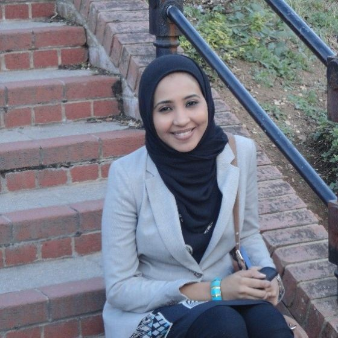
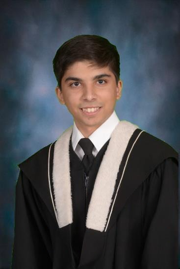
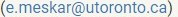

```{r setup, include=FALSE}
source("./_aux/links_supplementary.R")
source("./_aux/week01.R")
source("./_aux/week02.R")
source("./_aux/week03.R")
source("./_aux/week04.R")
source("./_aux/week05.R")
source("./_aux/week06.R")
source("./_aux/week07.R")
source("./_aux/week08.R")
source("./_aux/week09.R")
source("./_aux/week10.R")
source("./_aux/week11.R")
source("./_aux/week12.R")
```


::: {#header}
::: {#header-text .sec}
**`r course_code`: `r course_full_name`**<br>
<span class="header-subtitle">`r university` -- `r season` `r year`<br>`r department`</span>
:::

::: {#header-image .img}

::: 
:::


This course is designed as an *in-person* course aimed at introducing basic 
computer networks design concepts and protocols. For your convenience, all 
lectures and instructor's Office Hours will be also live-streamed 
over [Zoom](`r zoom_lec_l`). Furthermore, all lectures will be recorded and
posted on the course website. Note that tutorials won't be recorded 
and live-streamed.

## Course Staff

::: {#shuffleleft-container .col .sec}

::: instructorphoto

:::
::: instructorphoto

:::
::: instructorphoto

:::

::: instructorphoto

:::

::: instructorphoto

:::

::: instructorphoto

:::

:::


::: sechighlight
::: {#logistics .sec}
## Logistics
- **Instructor:** Erfan Meskar 
- **Lectures:** you can attend the lectures both in-person and 
over [Zoom](`r zoom_lec_l`).
  - **LEC0101:** Thursday, 01:00 PM - 03:00 PM, MN 2110.
  - **LEC0102:** Thursday, 05:00 PM - 07:00 PM, MN 1210.
- **Tutorials:** 
  - **PRA101:** Tuesday, 9 AM – 10 AM, Room DH2020 (*in-person only*)
  - **PRA102:** Tuesday, 10 AM – 11 AM, Room DH2020 (*in-person only*)
  - **PRA103:** Tuesday, 10 AM – 11 AM, Room DH2020 (*in-person only*)
  - **PRA106:** Tuesday, 4 PM – 5 PM, Room DH2020 (*in-person only*)
- **Office hours:**
  - Erfan Meskar (DH 3019 and [Zoom](`r zoom_lec_l`)): Thursday 11:30 AM - 12:30 PM
  and 03:30 PM - 04:30 PM
  - Ali Parchekani (MN 2190): Tuesday  2:00-3:00 PM
  - Sahil Gupta ([Zoom](`r zoom_sah_l`)): Wednesday 6:00 - 7:00 PM, Thursday 
  5:00 - 6:00 PM, Friday 5:00 - 6:00 PM
- **Contact**: 
  - Students should ask *all* course-related questions in course Piazza 
  channels. <br>
  - For personal matters only, email instructor.
-   **Announcements:** All announcements will be made in Piazza.
:::
:::


::: {#coursework .sec}
## Coursework
  - **Programming Assignments (32%)**
    - You will complete four programming assignments over the term.
    - The first one (*i.e.*, PA0) is worth 2%, and the other three are 
    worth 10% each.
    - These must be done individually.
    - The programming assignments must be submitted on [MarkUs](`r markus_l`), and 
    the submission deadline will be at 11:59 PM.
  - **Problem Sets (20%)**
    - You will complete two problem sets, each worth 10%.
    - These must be done individually.
    - Problem sets must be submitted on [Crowdmark](`r crowdmark_l`), and the submission
    deadline will be at 11:59 PM.
  - **Wireshark Labs (3%)**
    - You will complete three Wireshark labs worth 1% each over the term.
    - These must be done individually.
    - Wireshark labs must be submitted on [Quercus](`r quercus_l`), and the submission
    deadline will be at 11:59 PM.
  - **Midterm (15%)**
    - The midterm is scheduled for Feb. 28, 6:25 - 8:00 PM, at KN 137, which 
    will test the content of the weeks before the test.
    - The length of the midterm test will be 95 minutes and closed book.
    - Non-programmable calculators are allowed. Aid sheet is not allowed.
  - **Final Exam (30%)**
    - The final exam is closed book, comprehensive, 2 hours, and held during 
    the exam period.
    - Non-programmable calculators are allowed.
    - Aid sheet is not allowed.
    - You must obtain at least 40% on the final exam to pass the course; 
    otherwise, your final course grade will be set no higher than 47%.

All (currently tentative) deadlines are listed in the [schedule](#schedule). 
Note that **due dates may change** based on how the course is progressing.
:::

::: {#submitting .sec}
##  Submitting Coursework
- Do not submit your coursework via email.
- If anything goes wrong, please ask a question in Piazza or contact a course 
assistant.
- You can submit as many times as you'd like until the deadline: we will only 
grade the last submission.
- Partial work is better than not submitting any work.
:::

::: {#latedays .sec}
## Late Days
- You have 6 grace tokens to use throughout the semester. The 6 grace days
can be distributed across all assignments.
- A grace token extends the deadline by 24 hours.
- You can use up to 3 late days per assignment.
- Assignments submitted after the grace period will receive a grade of zero.
:::

::: {#sylremark .sec}
## Regrade Requests

Regrade requests for Programming Assignments, Problem Sets, Wireshark Labs, 
and Midterm are due within 1 week of receiving the graded work and must be 
submitted by posting a private question on Piazza.

  - We ask that you carefully review your assignments, reflect, and write a 
  short explanation justifying the reasons for a regrading request.
  - If a grade is contested and we realize that the marker made a mistake in the
  student's favour, the mark for that assignment may be lowered when the mistake
  is found. This would otherwise create a situation which is unfair to other
  students.
  - Please include your full name and UTORid in the body of the private note.
:::

::: {#schedule .container .sec}

## Course Schedule

|Week | Topics           | Readings    | Slides and<br>Recordings  | Worksheets | Coursework
|:----|:-----------------|:------------|:---------------|:-----------|:----------------------------------
|1    | `r W01_top`      | `r W01_rea` | `r W01_sli`| `r W01_wsh`| `r W01_crw`               
|2    | `r W02_top`      | `r W02_rea` | `r W02_sli`| `r W02_wsh`| `r W02_crw`              
|3    | `r W03_top`      | `r W03_rea` | `r W03_sli`| `r W03_wsh`| `r W03_crw`              
|4    | `r W04_top`      | `r W04_rea` | `r W04_sli`| `r W04_wsh`| `r W04_crw`             
|5    | `r W05_top`      | `r W05_rea` | `r W05_sli`| `r W05_wsh`| `r W05_crw`              
|6    | `r W06_top`      | `r W06_rea` | `r W06_sli`| `r W06_wsh`| `r W06_crw`
|Reading Week    
|7    | <span style="background-color: yellow;">**Midterm Week**</span>      |             |            | `r W07_wsh`| `r W07_crw`              
|8    | `r W08_top`      | `r W08_rea` | `r W08_sli`| `r W08_wsh`| `r W08_crw`              
|9    | `r W09_top`      | `r W09_rea` | `r W09_sli`| `r W09_wsh`| `r W09_crw`              
|10   | `r W10_top`      | `r W10_rea` | `r W10_sli`| `r W10_wsh`| `r W10_crw`              
|11   | `r W11_top`      | `r W11_rea` | `r W11_sli`| `r W11_wsh`| `r W11_crw` 
|12   | `r W12_top`      | `r W12_rea` | `r W12_sli`| `r W12_wsh`| `r W12_crw` 
:::
